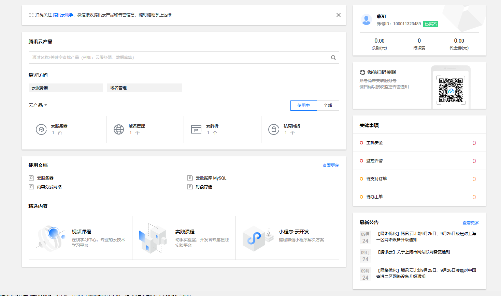
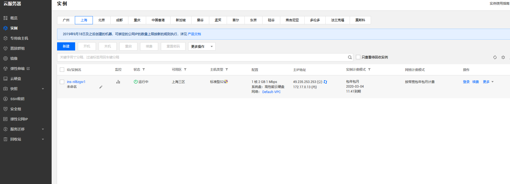
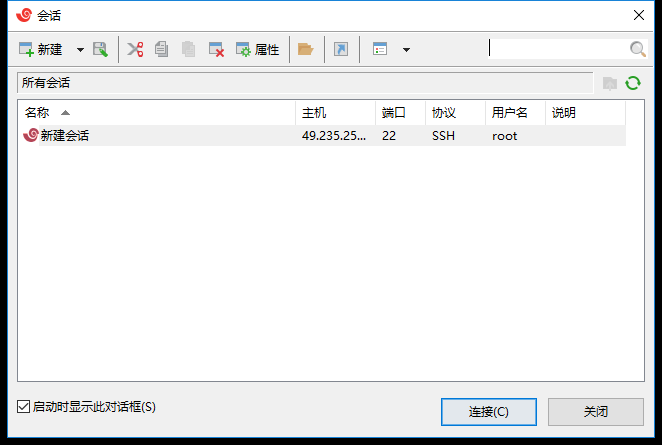
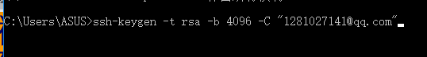

###   姓名：蔡洪                      学号：116072017015        班级：软工闽台      

1.购买腾讯云服务器并登录** 

   购买腾讯云服务器 

◼ 学生套餐

使用Web Shell登录已购买的云服务器实例

下载安装Xshell（包含在Xmanager中），并使用 

Xshell登录腾讯云实例

（1）腾讯云服务器

（2）下载安装Xshell（包含在Xmanager中），并使用 Xshell登录腾讯云实例

#### *2.*创建*GitHub项目并在本地同步

注册Github账号

#### （2）在GitHub上创建云计算项目（CloudComputing）并在 本地同步

  创建新的ssh key

复制“id_rsa.pub”的内容到GitHub网站的Settings–>SSH and GPG keys中

测试SSH Key是否配置成功

