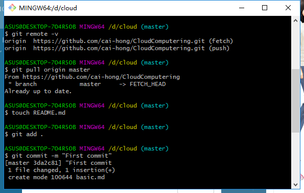

###   姓名：蔡洪                      学号：116072017015        班级：软工闽台      

### 一、购买腾讯云服务器并登录

   购买腾讯云服务器 

◼ 学生套餐

使用Web Shell登录已购买的云服务器实例

下载安装Xshell（包含在Xmanager中），并使用 

Xshell登录腾讯云实例

（1）腾讯云服务器

（2）下载安装Xshell（包含在Xmanager中），并使用 Xshell登录腾讯云实例

## 创建GitHub项目并在本地同步

注册Github账号

## 二、在GitHub上创建云计算项目（CloudComputing）并在 本地同步

  创建新的ssh key

复制“id_rsa.pub”的内容到GitHub网站的Settings–>SSH and GPG keys中

测试SSH Key是否配置成功

创建新的代码仓库

配置用户名和邮箱

1.初始化本地文件夹作为一个Git仓库：

2.拷贝GitHub网站中的项目网址

3.添加远程代码仓库的URL

4.从远程代码仓库拉取数据

5.新建README文档，README文档是每个GitHub项目必备，说明项目内容。上文没有创建，在此处完成

6.添加文件夹中的所有文件

7.提交文件

8.推送本地更新至远程服务

### 三、本地安装VMware Workstation和CentOS操作系统

安装VMware WorkStation

安装CentOs

