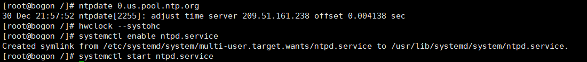

## Ceph的安装与实践

### 1.配置所有节点

**最小安装一台centos虚拟机**

**添加用户并配置sudo权限**

```
useradd -d /home/cephuser -m cephuser

passwd cephuser

echo "cephuser ALL = (root) NOPASSWD:ALL" | sudo tee /etc/sudoers.d/cephuser

chmod 0440 /etc/sudoers.d/cephuser

sed -i s'/Defaults requiretty/#Defaults requiretty'/g /etc/sudoers

```


安装设置open-vm-tools服务自动启动**

```
yum install -y open-vm-tools
 
systemctl enable vmtoolsd
 
systemctl start vmtoolsd
```


**安装配置ntp服务**

```
yum install -y ntp ntpdate ntp-doc
 
ntpdate 0.us.pool.ntp.org
 
hwclock --systohc
 
systemctl enable ntpd.service
 
systemctl start ntpd.service
```



**服务自动启动**

```
yum install -y open-vm-tools
 
systemctl enable vmtoolsd
 
systemctl start vmtoolsd
```

**安装配置ntp服务**

```
yum install -y ntp ntpdate ntp-doc
 
ntpdate 0.us.pool.ntp.org
 
hwclock --systohc
 
systemctl enable ntpd.service
 
systemctl start ntpd.service
```

**禁用SELINUX并添加ceph仓库****

sed -i 's/SELINUX=enforcing/SELINUX=disabled/g' /etc/selinux/config

sudo vi /etc/yum.repos.d/ceph.repo


**文件内容**

```
[ceph] 
name=Ceph packages for $basearch
baseurl=http://mirrors.163.com/ceph/rpm-jewel/el7/$basearch 
enabled=1
gpgcheck=0
priority=1
type=rpm-md
gpgkey=http://mirrors.163.com/ceph/keys/release.asc 
[ceph-noarch] 
name=Ceph noarch packages 
baseurl=http://mirrors.163.com/ceph/rpm-jewel/el7/noarch 
enabled=1 
gpgcheck=0 
priority=1 
type=rpm-md 
gpgkey=http://mirrors.163.com/ceph/keys/release.asc  
[ceph-source]
name=Ceph source packages 
baseurl=http://mirrors.163.com/ceph/rpm-jewel/el7/SRPMS 
enabled=0 
gpgcheck=0
type=rpm-md 
gpgkey=http://mirrors.163.com/ceph/keys/release.asc 
priority=1
```

**防火墙设置**

systemctl start firewalld

systemctl enable firewalld


**yum install -y open-vm-tools**

**克隆为三台机器**

**admin:192.168.6.129**

**mon1:192.168.6.130**

**osd1:192.168.6.132**

**osd2:192.168.6.131**

**主控节点防火墙**


**monistor节点防火墙**


**普通节点防火墙**


### 2. 配置SSH服务器

**主控节点**

vi /etc/hosts


**设置免密登录ssh**

su - cephuser

**生成密钥**

ssh-keygen


**vi ~/.ssh/config**

添加：


**更改配置文件的权限并生成秘钥**

chmod 644 ~/.ssh/config

ssh-keyscan osd1 osd2 mon1 >> ~/.ssh/known_hosts


使用ssh-copy-id命令将SSH密钥添加到所有节点。

```
ssh-copy-id ceph-admin
 
ssh-copy-id mon1
 
ssh-copy-id osd1
 
ssh-copy-id osd2
```

**测试连接各节点ssh**


### 3. ceph-deploy安装

**sudo yum update && sudo yum install ceph-deploy**


### **4.** **创建集群**

**mkdir cluster && cd cluster**

**ceph-deploy new mon1**

**vi ceph.conf**


### 5. 在所有节点上安装Ceph

ceph-deploy install ceph-admin mon1 osd1 osd2


需要mon1节点执行

**hostnamectl set-hostname mon1**

修改主机名为mon1


**主控节点**

**ceph-deploy mon create-initial**

**ceph-deploy gatherkeys mon1**


**为osd守护进程创建目录**

**osd节点**


**主控节点**

**将管理密钥部署到所有关联的节点。**

**准备所有OSDS节点**

**ceph-deploy osd prepare osd1:/var/local/osd osd2:/var/local/osd**

**激活OSD**

**ceph-deploy osd activate osd1:/var/local/osd osd2:/var/local/osd密钥部署到所有关联的节点。**

**ceph-deploy admin ceph-admin mon1 osd1 osd2**


## 6.检查集群状态

**从ceph-admin节点登录到ceph监视服务器“ mon1 ”，运行以下命令以检查集群运行状况。**

ssh mon1

**检查集群状态**

sudo ceph -s


