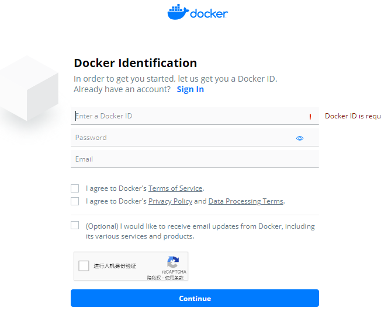
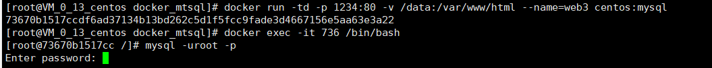

### 姓名：蔡洪         学号：116072017015        班级：软工闽台

### 实验一：安装Docker

#### **（1）先决条件**

使用如下命令查看操作系统内核信息：

 **uname -r**

顺带看一下Linux的版本号：

**cat /etc/redhat-release**

#### **（2）安装Docker**

首先更新应用程序数据库：

**sudo yum check-update**

添加Docker的官方仓库，下载最新的Docker并安装：

**curl -fsSL https://get.docker.com/ | sh**

确保Docker当服务器启动时自启动：

**sudo systemctl enable docker**

安装完成之后启动Docker守护进程，即Docker服务：

**sudo systemctl start docker**

验证Docker是否成功启动：

**sudo systemctl status docker**

查看一下Docker的版本信息：

**docker version**

### 实验二：完成Docker安装后加载CentOS镜像

#### （1）Docker基本操作

查看docker所有的命令，键入：**docker**

**docker --help**

查看当前系统docker的相关信息：**docker info**

#### （2）加载Docker镜像

命令从Docker Hub拉取centos镜像返回可用镜像的列表：

**docker search centos**

#### （3）拉取CentOS镜像后运行一个容器实例

接下来拉取官方版本(OFFICIAL)的镜像：

**docker pull centos：7**

镜像下载完成，可以基于该镜像运行容器，使用run命令：

查看一下当前系统中存在的镜像：

**docker image**

运行Docker容器（为了方便检测后续wordpress搭建是否成功，需设置端口映射（-p），将容器端口80 映射到主机端口8888，Apache和MySQL需要 systemctl 管理服务启动，需要加上参数 --privileged 来增加权，并且不能使用默认的bash，换成 init，否则会提示 Failed to get D-Bus connection: Operation not permitted ，，-name 容器名  ，命令如下 ）

**docker run -d -it --privileged --name wordpress -p 8888:80 -d centos:7 /usr/sbin/init**

*查看已启动的容器*：

**docker ps**

*进入容器前台*

docker exec -it 9843 /bin/bash

#### （4） 在该容器实例中安装WordPress并制作成镜像

#### 1.安装Apache Web服务器

*连接ssh后使用yum安装*： **yum install httpd**

*安装完成后，启动Apache Web服务器*

 **systemctl start httpd.service**

*设置开机自启*

**systemctl enable httpd.service**

测试Apache服务器是否成功运行，找到腾讯云实例的公有IP地址(your_cvm_ip)，在你本地主机的浏览器上输入：49.235.253.253：8888

#### 2.安装MySQL

**安装MariaDB**

yum install mariadb-server mariadb

**启动MariaDB**

systemctl start mariadb

**运行简单的安全脚本以移除潜在的安全风险，启动交互脚本：**

mysql_secure_installation

#### **3.安装PHP**

**PHP 7.x包在许多仓库中都包含，这里我们使用Remi仓库，而Remi仓库依赖于EPEL仓库，因此首先启用这两个仓库**

 yum install epel-release yum-utils
 yum install http://rpms.remirepo.net/enterprise/remi-release-7.rpm

（此图包含了开机自动启动MariaDB：systemctl enable mariadb.service）

**接着启用PHP 7.2 Remi仓库：**

yum-config-manager --enable remi-php72

**安装PHP以及php-mysql**

 yum install php php-mysql

**安装之后，重启Apache服务器以支持PHP：**

 systemctl restart httpd.service

**查看可用模块：**yum search php-

**这里先行安装php-fpm(PHP FastCGI Process Manager)和php-gd(A module for PHP applications for using the gd graphics library)，WordPress使用php-gd进行图片的缩放**

yum install php-fpm php-gd

**然后重启Apache服务**：service httpd restart

#### **4.安装WordPress以及完成相关配置**

##### **1.为WordPress创建一个MySQL数据库**

首先以root用户登录MySQL数据库：

**mysql -u root -p**

首先为WordPress创建一个新的数据库：

**CREATE DATABASE wordpress;**

接着为WordPress创建一个独立的MySQL用户：

**CREATE USER wordpressuser@localhost IDENTIFIED BY 'password';**

**GRANT ALL PRIVILEGES ON wordpress.* TO wordpressuser@localhost IDENTIFIED BY 'password';**

随后刷新MySQL的权限：

**FLUSH PRIVILEGES;**

最后，退出MySQL的命令行模式：

#### **2.安装WordPress**

因为官方下载途径已经无法使用，但是我们可以使用上次下载的安装包复制到容器

解压该文件：**tar xzvf latest.tar.gz**

解压之后在主目录下产生一个wordpress文件夹。我们将该文件夹下的内容同步到Apache服务器的根目录下，使得wordpress的内容能够被访问。这里使用rsync命令：

 rsync -avP /wordpress/ /var/www/html/**

接着在Apache服务器目录下为wordpress创建一个文件夹来保存上传的文件：

**mkdir /var/www/html/wp-content/uploads**

对Apache服务器的目录以及wordpress相关文件夹设置访问权限：

*** chown -R apache:apache /var/www/html/***

大多数的WordPress配置可以通过其Web页面完成，但首先通过命令行连接WordPress和MySQL。
 定位到wordpress所在文件夹：

**cd /var/www/html**

WordPress的配置依赖于wp-config.php文件，当前该文件夹下并没有该文件，我们通过拷贝wp-config-sample.php文件来生成：

**cp wp-config-sample.php wp-config.php**

然后，通过nano超简单文本编辑器来修改配置，主要是MySQL相关配置：

**nano wp-config.php**

没有下载nano使用了vi来编辑

#### 3.通过Web界面进一步配置WordPress

#### 

WordPress的控制面板：

#### （5）推送带有wordpress的镜像

*前往*[docker hub](https://hub.docker.com/)*注册账号*

***将容器生成镜像  (所生成的镜像名由   "Docker用户名/Docker仓库名组成"  ，否则推送会报错： denied: requested access to the resource is denied )***

docker commit -a "Docker用户名" -m "提交描述" 容器id 镜像名:tag标签

***登录Docker：docker login**

*推送镜像*：docker push 1281027141/centos:s1

##### *前往*docker hub查看推送的镜像

### 实验三：利用Dockerfile文件创建包含WordPress的镜像

##### （1）安装apache

**1.构建Dockerfile**

在本地主机新建一个目录（本文为mydocker）存放Dockerfile文件，新建Dockerfile文件：

**mkdir /mydocker**

**cd /mydocker**

**vim Dockerfile**

向Dockerfile文件中添加如下内容，注意本示例基于CentOS系统。

**ROM centos:latest**

**LABEL project="Dockerfile for Apache Web"**

**RUN yum -y install httpd**

**EXPOSE 80**

**VOLUME /var/www/html**

**ENTRYPOINT [ "/usr/sbin/httpd" ]**
**CMD ["-D", "FOREGROUND"]**

**2.生成docker镜像**

当前已经进入到mydocker目录，使用"docker build"命令来生成镜像

**docker build -t centos:httpd .**

**3.启动容器实例**

为刚才在Dockerfile中VOLUME创建挂载点。在本地主机下创建一个新目录（/data目录），用于挂载Apache Web的根目录/var/www/html，对应Dockerfile文件中定义的“VOLUME /var/www/html”。

**mkdir /data**

启动容器：

**docker run -td -p 80:80 -v /data:/var/www/html --name=web centos:httpd**

查看启动的容器实例：**docker ps**

**4.验证Apache Web（Httpd）是否安装成功**

在/data目录创建index.html文件，由于刚才设定了卷的挂载，index.html将自动挂载到容器的/var/www/html目录，而这个目录是Apache Web的根目录。

**cd /data**

**vim index.html**

添加如下内容：

**This is an apache httpd test. Build with dockerfile on CentOS 7.**
**Data are on host but share with volumn /var/www/html on the Docker container.**

**查看：**

##### （2）php

 在mydocker中创建php目录：**mkdir /php**

**1.构建Dockerfile**

**2.生成docker镜像**

**3.启动容器实例**

**docker run -td -p 8866:80 -v /data:/var/www/html --name=web1 centos7:php**

忘记截图了

**4.验证**

在容器中验证

用浏览器验证

##### （3）wordpress

**只是基于apche、php的wordpress**

**首先我先把上次下载的wordpress安装包latest.tar.gz放在Dockerfile同一目录下**

**1.构建Dockerfile**

**FROM  centos7:php**                    
**RUN yum install rsync -y**
**COPY latest.tar.gz /**
**RUN  tar xzvf latest.tar.gz**
**RUN rsync -avP /wordpress/ /var/www/html/**
**RUN mkdir /var/www/html/wp-content/uploads**
**RUN chown -R apache:apache /var/www/html/***
**#暴露端口**
**EXPOSE  80**      

                                                                                                                             

**2.生成docker镜像**

**docker build -t centos:wordpress .** 

**3.启动容器实例**

**4.验证**

由于无法连接到数据库所以只能显示这个样子，点击continue无法继续

##### （4）MySQL

**我的mysql安装用from后无法也无法弄到最后使wordpress使用上数据库，因为无法使用mysql无法连接到上面一个个from的最终容器中，所以这边单独做一个在一个容器里装了个mysql的dockerfile，基于php的容器上，一半的分数也不能不要嘛**

**1.构建Dockerfile**

**2.生成docker镜像**

**3.启动容器实例并进入容器验证**

**docker run -td -p 1234:80 -v /data:/var/www/html --name=web3 centos:mysql**

