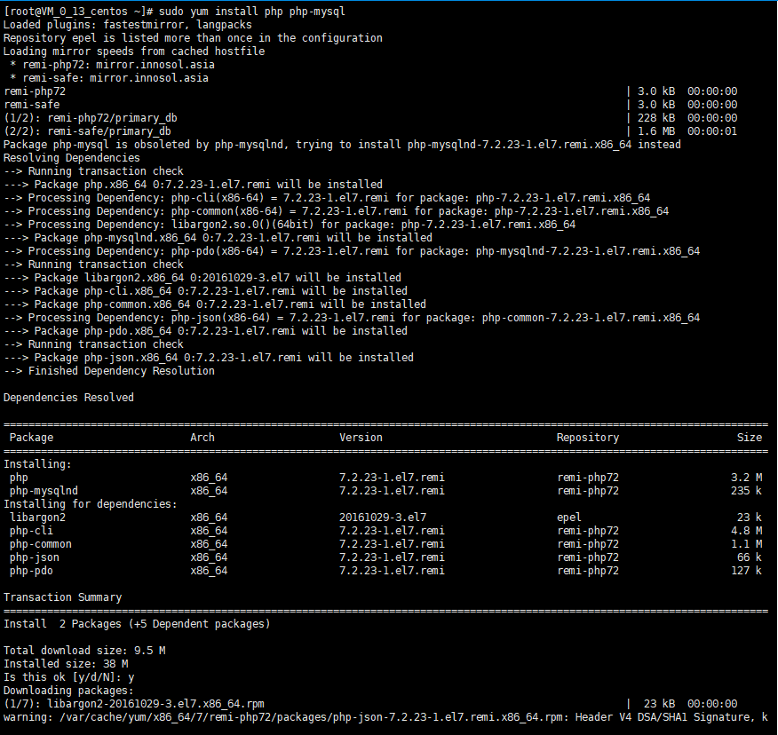

### 姓名：蔡洪         学号：116072017015        班级：软工闽台      

# **基于腾讯云创建个人网站**

### 使用WordPress创建个人网站

# 步骤

## 1.安装Apache Web服务器

sudo yum install httpd

sudo命令获得了root用户的执行权限，因此需要验证用户口令。
安装完成之后，启动Apache Web服务器：sudo命令获得了root用户的执行权限，因此需要验证用户口令。
安装完成之后，启动Apache Web服务器：sudo systemctl start httpd.service

测试Apache服务器是否成功运行，找到腾讯云实例的公有IP地址(your_cvm_ip)，在你本地主机的浏览器上输入：

## 2.安装MySQL

安装好之后，启动mariadb：

## 3.安装PHP

PHP 7.x包在许多仓库中都包含，这里我们使用Remi仓库，而Remi仓库依赖于EPEL仓库，因此首先启用这两个仓库

sudo yum install epel-release yum-utils
sudo yum install http://rpms.remirepo.net/enterprise/remi-release-7.rpm

启用php7.2Remi仓库

安装PHP以及myaql

### 安装PHP模块

为了更好的运行PHP，需要启动PHP附加模块，使用如下命令可以查看可用模块：yum search php-

结果如下

这里先行安装php-fpm(PHP FastCGI Process Manager)和php-gd(A module for PHP 
applications for using the gd graphics 
library)，WordPress使用php-gd进行图片的缩放。

重启Apache服务：

## 4.测试PHP

这里我们利用一个简单的信息显示页面（info.php）测试PHP。创建info.php并将其置于Web服务的根目录（/var/www/html/）：sudo vim /var/www/html/info.php

该命令使用vim在/var/www/html/处创建一个空白文件info.php，我们添加如下内容：

<?php phpinfo(); ?>

完成之后，使用刚才获取的cvm的IP地址

## 5.安装WordPress以及完成相关配置

### (1)为WordPress创建一个MySQL数据库

首先以root用户登录MySQL数据库：

mysql -u root -p

首先为WordPress创建一个新的数据库：

CREATE DATABASE wordpress;

接着为WordPress创建一个独立的MySQL用户：

CREATE USER wordpressuser@localhost IDENTIFIED BY 'password';

GRANT ALL PRIVILEGES ON wordpress.* TO wordpressuser@localhost IDENTIFIED BY 'password';

随后刷新MySQL的权限：

FLUSH PRIVILEGES;

最后，退出MySQL的命令行模式：

### 2)安装WordPress

下载WordPress至当前用户的主目录：

cd ~
wget http://wordpress.org/latest.tar.gz

wget命令从WordPress官方网站下载最新的WordPress集成压缩包，解压该文件：

tar xzvf latest.tar.gz

解压之后在主目录下产生一个wordpress文件夹。我们将该文件夹下的内容同步到Apache服务器的根目录下，使得wordpress的内容能够被访问。这里使用rsync命令：

sudo rsync -avP ~/wordpress/ /var/www/html/

接着在Apache服务器目录下为wordpress创建一个文件夹来保存上传的文件：

mkdir /var/www/html/wp-content/uploads

对Apache服务器的目录以及wordpress相关文件夹设置访问权限：

sudo chown -R apache:apache /var/www/html/*

### (3)配置WordPress

大多数的WordPress配置可以通过其Web页面完成，但首先通过命令行连接WordPress和MySQL。
 定位到wordpress所在文件夹：

cd /var/www/html

WordPress的配置依赖于wp-config.php文件，当前该文件夹下并没有该文件，我们通过拷贝wp-config-sample.php文件来生成：

cp wp-config-sample.php wp-config.php

然后，通过nano超简单文本编辑器来修改配置，主要是MySQL相关配置：

nano wp-config.php

### (4)通过Web界面进一步配置WordPress

设置网站的标题，用户名和密码以及电子邮件等，点击**Install WordPress**，弹出确认页面：

点击**Log In**，弹出登录界面：

输入用户名和密码之后，进入WordPress的控制面板：

